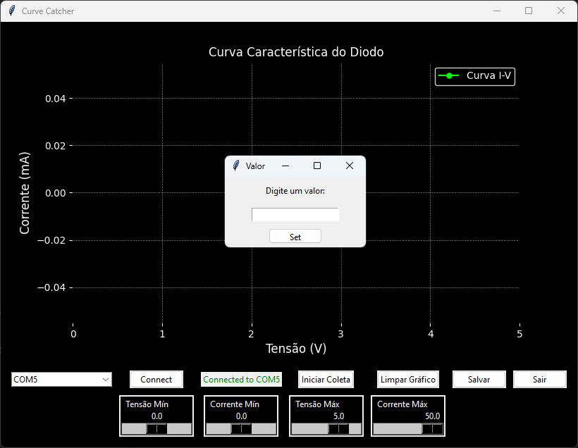

# Curve Catcher

## Descrição
O Curve Catcher permite a coleta e visualização gráfica de dados em tempo real de um diodo (ou qualquer outro componente do tipo) utilizando um Arduino ou outra dev board. Ele simula um curve tracer, permitindo ajustes dos limites dos eixos X e Y em tempo real.

## Funcionalidades
- Conexão com diferentes portas seriais.
- Coleta de dados em tempo real e visualização gráfica.
- Ajuste dinâmico dos limites dos eixos do gráfico.
- Salvar dados e gráficos.
- Interface amigável com controle via sliders e botões.

## Capturas de Tela

- Essa será sua tela inicial ao rodar o programa.

- Escolha sua porta serial e aperte em conectar.

- É possível ajustar o gráfico com os sliders (em tempo real!), se você preferir colocar um valor específico, basta clicar 2 vezes com o botão esquerdo no slider

- Clique em iniciar coleta para gerar o gráfico, sinta-se livre para ajustar o gráfico e depois para salvar, basta clicar no botão "salvar", os valores da coleta e o gráfico gerado serão salvos com o mesmo nome.

